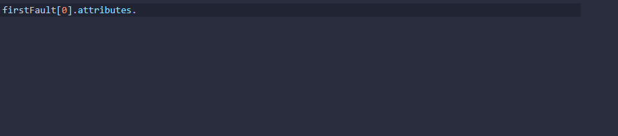
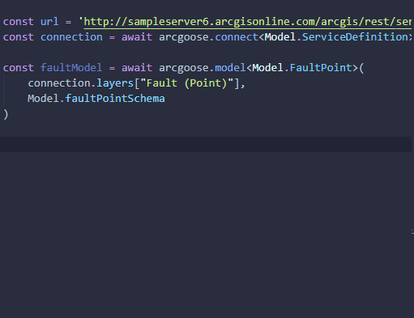

# Arcgoose Typegen

This tool generate Typescript Interfaces based on ArcGIS Feature Services to use with [esri/arcgoose](https://github.com/esri/arcgoose).

Use `npx arcgoose-typings <FeatureServiceURL> <OutputFileName.ts>` to create TypeScript Interfaces which match your FeatureService and can be used with arcgoose.

Create a Model.ts Definition File (include Token for secured Services)
```bash
npx arcgoose-typings http://sampleserver6.arcgisonline.com/arcgis/rest/services/Energy/Geology/FeatureServer Model.ts
```

You have following additional options:
 - `--include-docs` Adds some TS-Doc Information from ArcGIS
 

 - `--use-alias`: uses all Field-Aliases instead of field-names. Can get ugly if your feature-service has 'nice' Aliases
 ```typescript
// with --use-alias
interface FeatureLayer {
  "Employe ID": string
}

let value = feature.attributes["Employe ID"]

// wihtout --use-alias
interface FeatureLayer{
  employe_id: string
}
let value = feature.attributes.employe_id
 ```

 ## Usage in Action
 